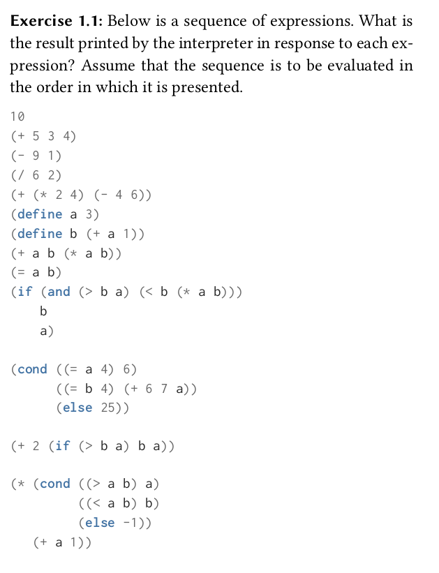
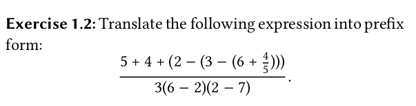
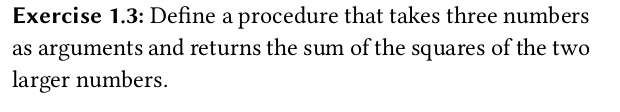
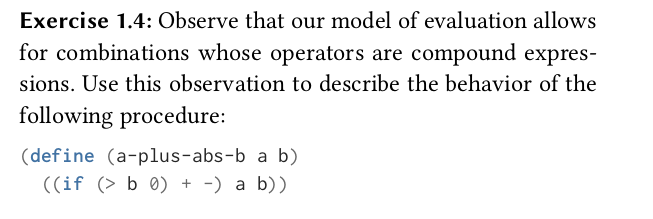
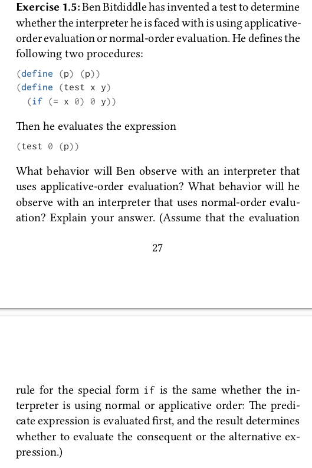
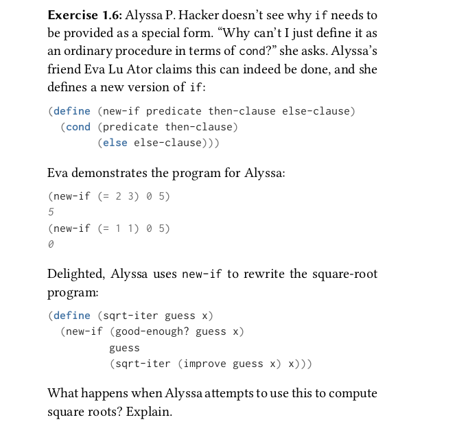
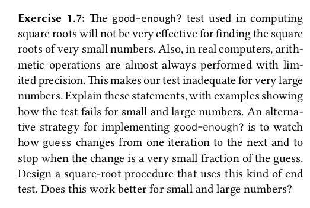
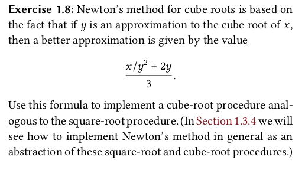

[TOC]

# Exercise_Sol

写在前面的话，SICP除了其深邃的函数式编程的思想，其练习题也是很重要很重要的一部分！不做习题约等于没读书！

## chapter 1

### 1.1

Sol

    <pre>
        带;开头的表示实际上不会被打印出来
        10
        12
        8
        3
        8 + (-2) = 6
        ; a = 3
        ; b = a + 1 = 4
        (a * b) + b + a = 19
        a = b --> false --> #f
        4
        16
        6
        16
    </pre>

### 1.2

Sol

	<pre>
	本质是一道中缀转前缀的算法题(haha)<a href="https://juejin.cn/post/7123210350484258823">具体可以参考这个文章</a>
	答案(/ (+ 5 4 (- 2 (- 3 (+ 6 (/ 4 5))))) (* 3 (- 6 2) (- 2 7)))
	更可读的形式
	(/
	  (+ 5 4
	   ( - 2
	     ( - 3
	        (+ 6
	          ( / 4 5)))))
	  ( * 3
	     (- 6 2)
	     (- 2 7)))
	     </pre>

### 1.3

	 	   
Sol

    <pre>
    <code >
(define (sum_of_three a b c)
  (cond ((<= a b c) (+ b c)) ； a <= b <= c
        ((<= b a c) (+ a c)) ; b <= a <= c
        (else (+ a b))))
    </code>
    </pre>

### 1.4

关注点在`((if (> b 0) + -) a b)` if相当于直接返回了一个表达式

### 1.5

Sol

	<pre>
	首先解释一下(define (p) (p)),本质定义了一个无限递归的过程，一但调用(p)则会无穷的调用自身。
	如果采用"normal-order evaluation"会先判断 x 是否等于0,而不会调用(p),但如果采用"applicative-order evaluation"则在调用(test o (p))时候就会调用(p)导致无穷递归。
	</pre>

### 1.6

Sol

	<pre>
		..
	</pre>

### 1.7

Sol

	<pre>
	</pre>

### 1.8

Sol

    <pre>
    </pre>

