[TOC]

# Exercise_Sol

写在前面的话，SICP除了其深邃的函数式编程的思想，其练习题也是很重要很重要的一部分！不做习题约等于没读书！

## chapter 1

### 1.1


<details><summary>Sol</summary>
    <pre>
        带;开头的表示实际上不会被打印出来
        10
        12
        8
        3
        8 + (-2) = 6
        ; a = 3
        ; b = a + 1 = 4
        (a * b) + b + a = 19
        a = b --> false --> #f
        4
        16
        6
        16
    </pre>
</details>

### 1.2


<details><summary>Sol</summary>
	<pre>
	本质是一道中缀转前缀的算法题(haha)<a href="https://juejin.cn/post/7123210350484258823">具体可以参考这个文章</a>
	答案(/ (+ 5 4 (- 2 (- 3 (+ 6 (/ 4 5))))) (* 3 (- 6 2) (- 2 7)))
	更可读的形式
	(/
	  (+ 5 4
	   ( - 2
	     ( - 3
	        (+ 6
	          ( / 4 5)))))
	  ( * 3
	     (- 6 2)
	     (- 2 7)))
	     </pre>
</details>

### 1.3


<details>
	 	   <summary>Sol</summary>
    <pre>
	<a href="./Code/Ex1_3.scm">参考代码</a>
	”判断三个数中的较大值可以用如下决策🌲描述“
	   x < y
          /    \
         /      \
        /        \
    x < z         y < z
     / \           / \
    /   \         /   \
x < y  x < y   y < x  y < x
x < z  z < x   y < z  z < y
    </pre>
</details>


### 1.4


关注点在`((if (> b 0) + -) a b)` if相当于直接返回了一个表达式

### 1.5


<details><summary>Sol</summary>
	<pre>
	首先解释一下(define (p) (p)),本质定义了一个无限递归的过程，一但调用(p)则会无穷的调用自身。
	如果采用"normal-order evaluation"会先判断 x 是否等于0,而不会调用(p),但如果采用"applicative-order evaluation"则在调用(test o (p))时候就会调用(p)导致无穷递归。
	</pre>
</details>
### **1.6**


<details><summary>Sol</summary>
	<pre>
	注意在Scheme中if并不是个简单的过程，二是个很特殊的形式。只有当第一个谓词为假的时候才会执行第二部分，而由于Scheme采用应用序处理程序，new-if实际上每部分都会被执行，导致上述代码会陷入无限递归从而报错！
	可以参考这个<a href="./Code/Ex1_6.scm">例子</a>,会发现内置的if只打印了good，而自己写的new-if打印了badgood,至于为啥是badgood只是解释器的实现问题而以。
	</pre>
</details>


### 1.7


<details><summary>Sol</summary>
	<pre>
	本质是浮点数精度问题，优化后的<a href="./Code/Ex1_7.scm">代码</a>
	</pre>
</details>


### 1.8


<details><summary>Sol</summary>
    <pre>
    </pre>
</details>
### **1.9 递归与迭代 trace**

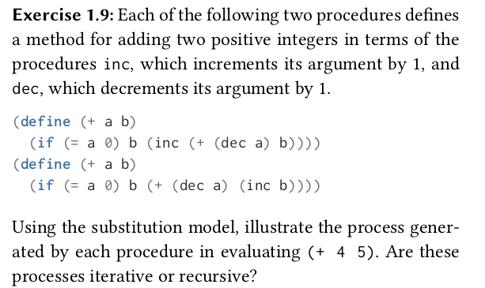

<details><summary>Sol</summary>
<pre>
	使用(trace plus)就可以观察到结果啦！
	第一种情况
        |(plus 4 5)
        | (plus 3 5)
        | |(plus 2 5)
        | | (plus 1 5)
        | | |(plus 0 5)
        | | |5
        | | 6
        | |7
        | 8
        |9
        9
        典型的递归过程
	第二种情况
	|(plus 4 5)
        |(plus 3 6)
        |(plus 2 7)
        |(plus 1 8)
        |(plus 0 9)
        |9
        9
        典型的迭代过程
</pre>
</details>

### 1.10 Ackermann's function 阿克曼函数


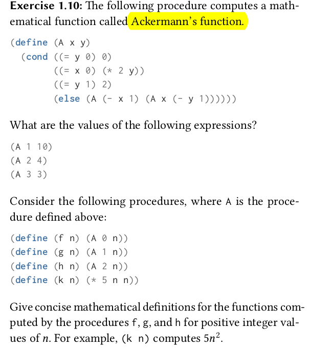

<details><summary>Sol_trace第一个</summary>
<pre>
	使用trace 跟踪过程
	第一个
        |(A 1 10)
        | (A 1 9)
        | |(A 1 8)
        | | (A 1 7)
        | | |(A 1 6)
        | | | (A 1 5)
        | | | |(A 1 4)
        | | | | (A 1 3)
        | | | | |(A 1 2)
        | | | | | (A 1 1)
        | | | | | 2 (y == 1)
        | | | | |(A 0 2)
        | | | | |4 (x == 0)
        | | | | (A 0 4)
        | | | | 8 
        | | | |(A 0 8)
        | | | |16 
        | | | (A 0 16)
        | | | 32 
        | | |(A 0 32)
        | | |64 
        | | (A 0 64)
        | | 128 
        | |(A 0 128)
        | |256 
        | (A 0 256)
        | 512 
        |(A 0 512)
        |1024 
        1024
</pre>
</details>

<details><summary>Sol_trace第二个</summary>
<pre>
	使用trace 跟踪过程
        第二个
        |(A 2 4)
        | (A 2 3)
        | |(A 2 2)
        | | (A 2 1)
        | | 2  (y == 1)
        | |(A 1 2)
        | | (A 1 1)
        | | 2 (y == 1)
        | |(A 0 2)
        | |4 (x == 0)
        | (A 1 4)
        | |(A 1 3)
        | | (A 1 2)
        | | |(A 1 1)
        | | |2 (y == 1)
        | | (A 0 2)
        | | 4 (x == 0)
        | |(A 0 4)
        | |8 
        | (A 0 8)
        | 16 
        |(A 1 16)
        | (A 1 15)
        | |(A 1 14)
        | | (A 1 13)
        | | |(A 1 12)
        | | | (A 1 11)
        | | | |(A 1 10)
        | | | | (A 1 9)
        | | | | |(A 1 8)
        | | | | | (A 1 7)
        | | | |[10](A 1 6)
        | | | |[11](A 1 5)
        | | | |[12](A 1 4)
        | | | |[13](A 1 3)
        | | | |[14](A 1 2)
        | | | |[15](A 1 1)
        | | | |[15]2 (y == 1)
        | | | |[14](A 0 2)
        | | | |[14]4
        | | | |[13](A 0 4)
        | | | |[13]8
        | | | |[12](A 0 8)
        | | | |[12]16
        | | | |[11](A 0 16)
        | | | |[11]32
        | | | |[10](A 0 32)
        | | | |[10]64
        | | | | | (A 0 64)
        | | | | | 128
        | | | | |(A 0 128)
        | | | | |256
        | | | | (A 0 256)
        | | | | 512
        | | | |(A 0 512)
        | | | |1024
        | | | (A 0 1024)
        | | | 2048
        | | |(A 0 2048)
        | | |4096
        | | (A 0 4096)
        | | 8192
        | |(A 0 8192)
        | |16384
        | (A 0 16384)
        | 32768
        |(A 0 32768)
        |65536
</pre>
</details>

<details><summary>Sol_trace第三个</summary>
<pre>
	使用trace 跟踪过程
	第三个
        |(A 3 3)
        | (A 3 2)
        | |(A 3 1)
        | |2
        | (A 2 2)
        | |(A 2 1)
        | |2
        | (A 1 2)
        | |(A 1 1)
        | |2
        | (A 0 2)
        | 4
        |(A 2 4)
        | (A 2 3)
        | |(A 2 2)
        | | (A 2 1)
        | | 2
        | |(A 1 2)
        | | (A 1 1)
        | | 2
        | |(A 0 2)
        | |4
        | (A 1 4)
        | |(A 1 3)
        | | (A 1 2)
        | | |(A 1 1)
        | | |2
        | | (A 0 2)
        | | 4
        | |(A 0 4)
        | |8
        | (A 0 8)
        | 16
        |(A 1 16)
        | (A 1 15)
        | |(A 1 14)
        | | (A 1 13)
        | | |(A 1 12)
        | | | (A 1 11)
        | | | |(A 1 10)
        | | | | (A 1 9)
        | | | | |(A 1 8)
        | | | | | (A 1 7)
        | | | |[10](A 1 6)
        | | | |[11](A 1 5)
        | | | |[12](A 1 4)
        | | | |[13](A 1 3)
        | | | |[14](A 1 2)
        | | | |[15](A 1 1)
        | | | |[15]2
        | | | |[14](A 0 2)
        | | | |[14]4
        | | | |[13](A 0 4)
        | | | |[13]8
        | | | |[12](A 0 8)
        | | | |[12]16
        | | | |[11](A 0 16)
        | | | |[11]32
        | | | |[10](A 0 32)
        | | | |[10]64
        | | | | | (A 0 64)
        | | | | | 128
        | | | | |(A 0 128)
        | | | | |256
        | | | | (A 0 256)
        | | | | 512
        | | | |(A 0 512)
        | | | |1024
        | | | (A 0 1024)
        | | | 2048
        | | |(A 0 2048)
        | | |4096
        | | (A 0 4096)
        | | 8192
        | |(A 0 8192)
        | |16384
        | (A 0 16384)
        | 32768
        |(A 0 32768)
        |65536
        65536
</pre>
</details>

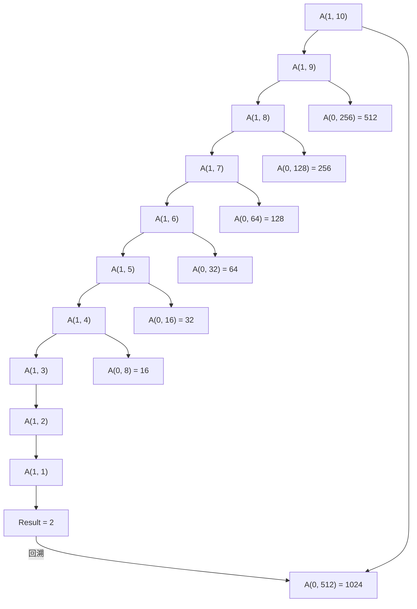

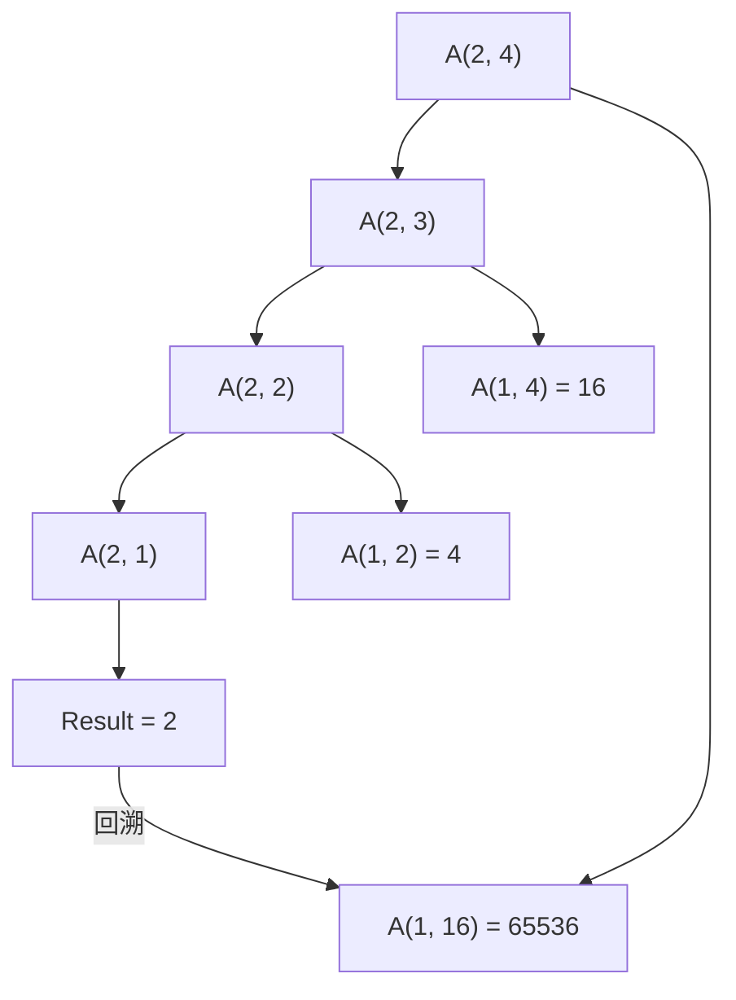

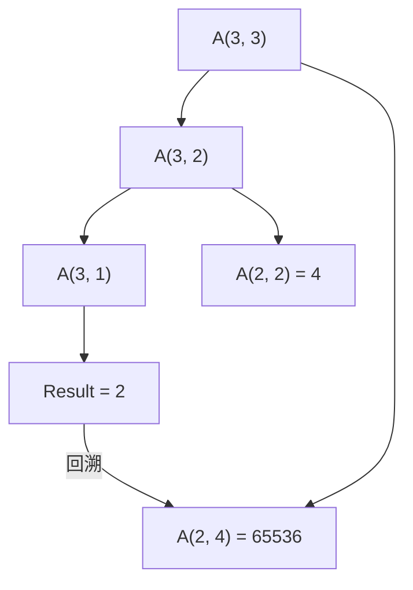

<details><summary>Sol</summary>
<pre>
	f = 2n
	g = 2^n
	h = 连续求n次2的2次幂
</pre>
</details>
### Ex1_11 树型递归与迭代

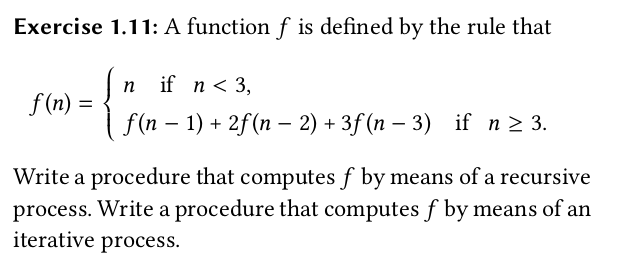

<details><summary>Sol</summary>
<pre>
版本1:递归版本 按公式翻译一下
<code>
(define (f-rec n)
    (if (< n 3) 
        n
        (+  (f-rec (- n 1)) 
            (* 2 (f-rec (- n 2)))
            (* 3 (f-rec (- n 3))))))
</code>
迭代版本
<code>
(define (f-iter n) (f 0 1 2 n))
(define (f a b c count)
        (if (= count 0) 
            a
            (f  b
                c
                (+ (* a 3) (* b 2) c)
                (- count 1))))
</code>
</pre>
</details>

### Ex1_12 杨辉三角

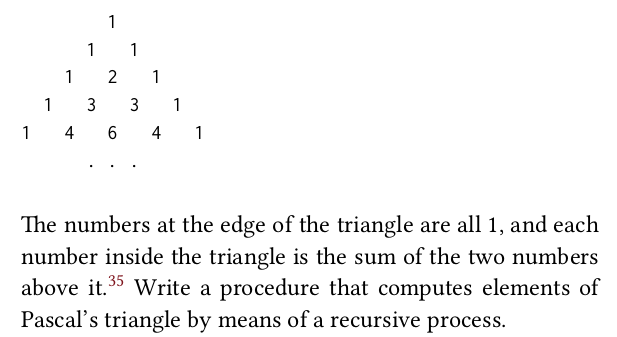

<details><summary>Sol</summary>
<pre>
<code>
(define (sum x y)
    (cond   
        ((= y 0) 1) ; 左边恒定为1
        ((= x y) 1) ; 右边恒定为1
        ((or (< x y) (< x 0)) 0) ; 不存在三角形内的数
        (else (+ (sum (- x 1) (- y 1))
                (sum (- x 1) y)))))
(display (sum 10 5))
(exit)
</code>
</pre>
</details>

### Ex1_13证明Fib(n) = $\frac{(\frac{(1+\sqrt5)}{2})^n}{\sqrt5}$

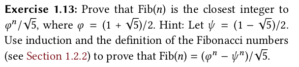

$由Fib(0)=1,Fib(1)=1,Fib(2)=2,同时代入Fib(n)=(\varphi^n-\psi^n)/\sqrt5,发现结论成立，不妨假设对于\\Fib(k)有Fib(k-1)=(\varphi^{k-1}-\psi^{k-1})/\sqrt5\\Fib(k)=(\varphi^k-\psi^k)/\sqrt5\\发现\varphi\times\psi=-1,Fib(k-1)=-(\varphi^n\psi-\psi^n\varphi)/\sqrt5\\代入Fib(k+1)=Fib(k)+Fib(k-1)=(\varphi^n(1-\psi)-\psi^n(1-\varphi))/\sqrt5即\\Fib(k+1)=(\varphi^{k+1}-\psi^{k+1})/\sqrt5\\由数学归纳法可知Fib(n)=(\varphi^n-\psi^n)/\sqrt5$

### Ex1_14 递归的时间复杂度与空间复杂度的计算

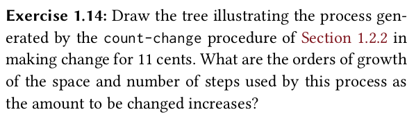

<details><summary>Sol</summary>
<pre>
递归调用树如下
                   cc(11, 5)
                  /         \
           cc(11, 4)        cc(-39, 5)
            /    \                (无效)
      cc(11, 3) cc(-14, 4)(无效)
        /   \
   cc(11, 2) cc(1, 3)
     /   \       \
cc(11, 1) cc(6, 2) cc(1, 2)
    |       /   \       |
    1   cc(6, 1) cc(1, 1)
        |       |
       1       1
Final Total = 4
复杂度分析 时间复杂度为\theta(2^k),空间复杂度为\theta(k) , 其中k是硬币种类。
</pre>
</details>

### Ex1_15 sinx的近似计算


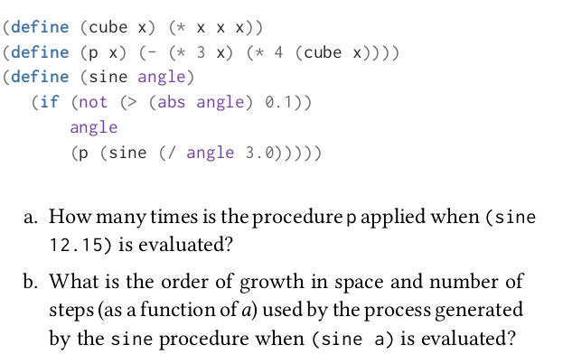

<details>
	 	   <summary>Sol</summary>
    <pre>
    a. 5次 (可以通过trac查看)
    b.时间和空间复杂度都是log(a)级别的，因为每次递归都是把a = a/3.0的尾递归。
    </pre>
</details>

### Ex1_16

```markdown
			    		   Design a procedure that evolves an iterative exponentiation process that uses successive squaring and uses a logarithmic number of steps, as does fast-expt.
(Hint: Using the observation that (b n/2 )2 = (b 2 )n/2 , keep,along with the exponent n and the base b, an additional
state variable a, and define the state transformation in such a way that the product ab n is unchanged from state to state. At the beginning of the process a is taken to be 1, and the answer is given by the value of a at the end of the process. In general, the technique of defining an invariant quantity that remains unchanged from state to state is a powerful way to think about the design of iterative algorithms.)
```

### Ex1_17

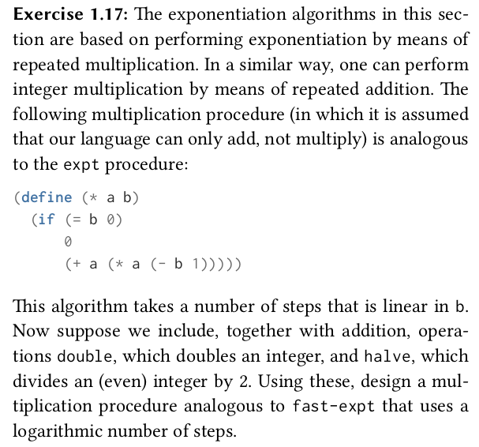
