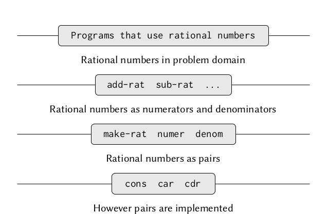

[TOC]

## Building Abstractions with Data 

### Introduction to Data Abstraction

主要内容

- Scheme内的`cons` `car` `cdr`
- 过程与数据并没有太多差距
- 两个案例:有理数的计算 和 区间算术

> [!important]
>
> the basic idea of data abstraction is to structure the programs that are to use compound data objects so that they operate on "abstract data".

#### Example: 有理数的计算



这个例子本身并没有过多值的记录的，需要注意的是`data-abstraction barries`,通过一层一层的抽象，把程序通过`interface`分割成不同的抽象层，可以优化程序结构。

#### What is Meant by Data?

> [!important]
>
> In general, we can think of data as defined by some collection of selectors and constructors, together with specified conditions that these procedures must fulfill in order to be a valid representation.

Scheme里面的`cons` `car` `cdr` 虽然是内置的操作，但可以通过不含有任何数据抽象的方式实现,如

```scheme
(define (mycons x y)
  (define (dispatch m)
    (cond ((= m 0) x)
            ((= m 1) y)
            (else (errror "Argument not 0 or 1 -- CONS" m))))
   dispatch)

(define (car z) (z 0))
(define (cdr z) (z 1))
```

大体上上述实现和内置的基本一致，但不同点也是有的

- (mycons x y) 返回的是一个procedure 而(cons x y)返回的是一个pair(data-abstraction)

### Hierarchical Data and the Closure Property