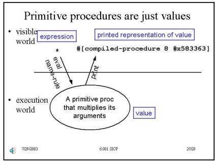

[TOC]

# Structure and Interpretation of computer Programs 2nd

## Building Abstractions With Procedures

对应04版本内容

- Introduction to Computation

对应书本

- chapter 1

### Introduction to Computation

==[Slide](./slides/lecture_1.pdf)==

> [!important]
>
> Computer science is dealing with a different kind of knowledeg --- Imperative or "how to" knowledeg!

|                       | what is                    | example                                                      |
| --------------------- | -------------------------- | ------------------------------------------------------------ |
| declarative knowledge | talks about "what is true" | $\sqrt x\ is\ the\ y\ such\ that\ y^2=x\ and\ y\geq0$        |
| imperative knowledge  | talks about "how to"       | - Make a guess G<br />- Improve the guess by averaging G and x/G<br />- Keep improving the guess until it is good enough |

> [!important]
>
> - Create a set of primitive elements in language 
>   - simple data and simple procedures
> - Create a set of rules for combining elements of language
> - Create a set of rules for abstracting elements
>   - treat comple things as primitives

> sicp的本质就是告诉我们计算机是一层又一层的抽象，所谓的内置数据类型不过是底层机器的抽象罢了。

### Scheme Basic

==Rules for Scheme==

> [!note]
>
> 1. Legal expression have rules for constructing from simpler pieces
> 2. (Almost) every expression has a value, which is "returned"when an expression is "evaluated"
> 3. Every value has a type.


==Rules of evaluation==

> [!note]
>
> 1. if self-evalutaing, return value
> 2. if a name, return value associated whit name in enviroment.
> 3. if a special form, do something special
> 4. if a combination, then
>    1.  Evaluate all of the subexpression of combination(in any order)
>    2. apply the operator to the values of the operands (arguments) and return result

|                                |                             |
| ------------------------------ | --------------------------- |
| ==Self-evaluating primitives== | ==Built-in procedures==     |
| Numbers: 29, -35, 1.34, 1.2e5  | +,-,*,/,>,<,$\geq$,$\leq$,= |
| Strings: "this is string"      | string-length, string=?     |
| Booleans: #t, #f               | and , or, not               |

> [!CaUtion]
>
> `+` --> #<procedure +>

```scheme
(+ 2 3)
|-|-|---|------>open paren
   |-|---|------->Expression whose value is a procedure
     |---|-------->other expressions
         |-------->close paren
```

==nested combination==

```scheme
(+ (* 2 3) 4) --> 10
(* (+3 4) (- 8 2)) --> 42
```

==Define==

> [!important]
>
> define is a special expression, it pairs name with value of the third expression,
>
> return value is **unspecified**

```scheme
(define score 23)
```

associtae `score` with `23`


==`+` only a name of procedure==

```scheme
(+ 3 5) --> 8
(define fred +) ---> undef
(fred 4 6) ---> 10
```

> [!important]
>
> - `+` is jues a name
> - `+` is bound to a value which is a procedure
> - line 2 binds the name fred to that same value


