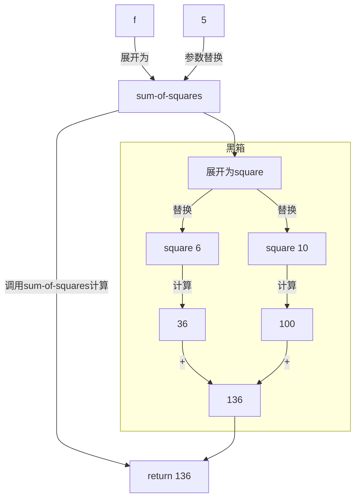
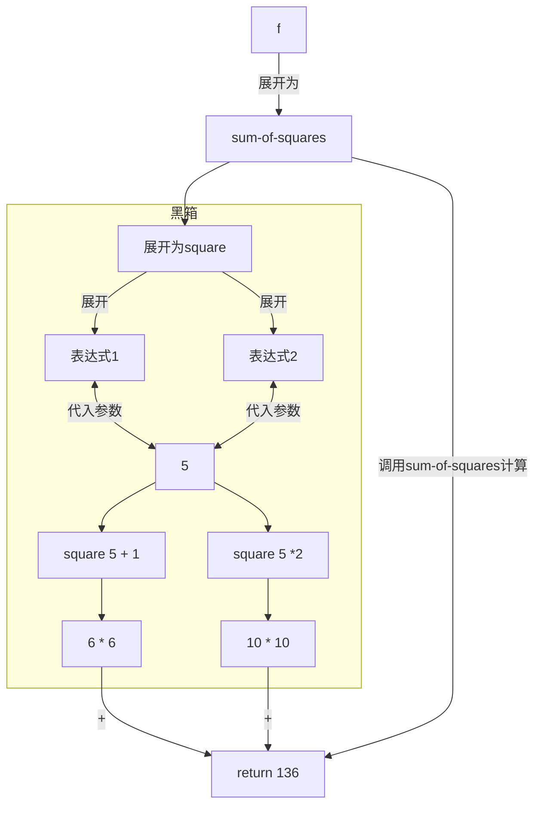
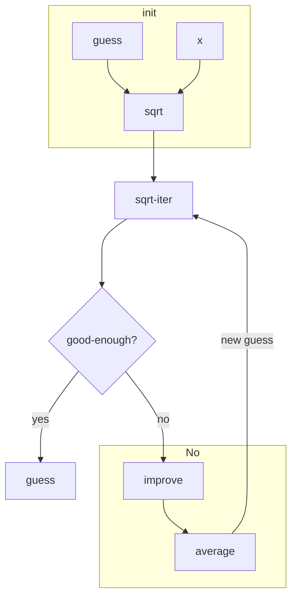

[TOC]

# Structure and Interpretation of computer Programs 2nd

## chapter 0 环境配置

SICP毕竟是一本比较古老的书，采用的语言是Scheme语言，一种典型的语法简单的函数式语言。

> ## 配置环境
>
> 方法一：`DrRacket`
>
> 以`DrRacket`作为IDE，从[这里](https://mirrors.tuna.tsinghua.edu.cn/racket-installers/recent/)下载，有`Linux` `macOS` `win`三个版本
>
> linux下载`xxx.sh`版本
>
> ```bash
> cd Downloads
> chmod +x xxxxx.sh
> ./xxxx.sh
> 按默认安装即可
> ```
>
> .png?raw=true)
>
> 点击`file` ---> `package manager` ---> 搜索`sicp`回车、自动下载。
>
> ps:是从github上下载的，请保证网络环境！
>
> 完成后在上方输入`#lang sicp`在点右上`Run`
>
> 下方提示
>
> 即配置成功！
>
> 方法二：Vscode -- Chez插件 [推荐]
>
> Linux 
>
> ```bash
> sudo  apt-get install chezscheme #Ubuntu
> ```
>
> 查看是否成功
>
> ```bash
> scheme --version
> ```
>
> 去vscode里面下载`vscode-chez`插件和`run-code`插件
>
> 然后在配置文件里面写入
>
> ```json
> {
>     "code-runner.executorMap": {
>         "scheme": "scheme"
>     },
>     "code-runner.clearPreviousOutput": true,
>     "code-runner.runInTerminal": true,
>     "code-runner.saveFileBeforeRun": true
> }
> 
> ```
>
> 注意macOS用
>
> ```bash
> brew   install  chez
> alias scheme="chez"
> ```


## chapter 1 Building Abstractions With Procedures

> # The Elements of Programming
>
> - primitve expressions(原始表达式) 语言的基本单位
> - measn of combination(组合) 如何将基本单位组合成更复杂的结构
> - means of abstraction（抽象）如何用模式或结构简化和组织代码

> [!Note]
>
> *Scheme* 语法知识
>
> 表达式采用前缀表达式(prefix)
>
> - accommodate procedures that may take an arbitrary number of arguments
>
>   - ```Scheme
>     (+ 21 35 12 7)
>     75
>     (* 25 4 12)
>     1200
>     ```
>
> - No ambiguity(歧义) can arise, because the operator is always the leftmost element and the entire combination is delimited(分割) by the parentheses
>
>   - ```scheme
>     (+ (* 3 5)(- 10 6))
>     19
>     (+ (* 3 (+ (* 2 4) (+ 3 5))) (+ (- 10 7) 6)) 
>     57
>     ; pretty-printing
>     (+ (* 3
>      	       (+ (* 2 4)
>      	           (+ 3 5)))
>     (+ (- 10 7)
>          6))
>     57
>     ```
>
> Naming and the Enviroment
>
> ```scheme
> ; 注意括号是必须的
> (define size 2)
> size
> 2
> (* 5 size)
> 10
> ; pi = 3.14159
> (define pi 3.14159)
> ; radius = 10
> (define radius 10)
> ; pi * r * r
> (* pi (* radius radius))
> 314.159
> ; circumference = 2 * pi * radius
> (define circumference (* 2 pi radius))
> circumference
> 62.8318
> ```
>
> Conditional Expressions and Predicates(谓词)
>
> `cond`(stands for "conditional")
>
> ```scheme
> (define (abs x)
>    (cond ((> x 0) x)
>            ((= x 0) 0)
>            ((< x 0) (- x)))) 
> ; x前的空格千万不能忘记！
> 
> (define (abs x) 
>    (cond ((< x 0) (- x))
>          (else x)))
> 
> (define (abs x)
>   		  (if (< x 0)
>         (- x)
>       x ))
> ```
>
> <if <predicate>> <consequent> <alternative>
>
> > ### if 
> >
> > `if`并不是一个简单的函数，也是采用中断执行。尤其是在Scheme采用应用序的情况下。具体参考Ex1_6关于`new-if 函数实现`和Scheme内置的`if`的
>
> `not` `and` `or` 再Scheme里面`and` 和 `or` 一样是短路设计的
>
> ```scheme
> (and ( > x 5) ( < x 10)) ;  5 < x < 10
> (define (>= x y) (or (> x y) ( = x y)))
> ; 也可以写成
> (define (>= x y) (not (< x y)))
> ```

### Evaluating Combinations

重点在于`递归(recursion)`解析表达式

- Evaluate the subexpressions of the combination.
- Apply the procedure that is the value of the leftmost subsecpression(the operator) to the arguments that are the values of other subexpressions(the operands)

```scheme
(* ( + 2 ( * 4 6)))
	    (+ 3 5 7))
```

<details><summary>Tree represntation(Try it yourself)</summary>
    <div>
        
    </div>
</details>


> # take care of the primitive cases 
>
> - the values of numerals are the numbers that they name,
> -  the values of built-in operators are the machine instruction sequences that carry out the corresponding operations, and
> - the values of other names are the objects associated with those
>   names in the environment.
>
> >  [!Important]
> >
> > The key point to notice is the role of **the environment in determining the meaning** of the symbols in expressions.

Suche exceptions to the general evaluation rule are called *special forms*.the `define` is the only example of a special form that we have seen so far.

> ### That is, (define x 3) is not a combination.
>
> ```scheme
> (define x 3)
> ```
>
> **associate x wiht a value.**

### Compound Procedures

**procedure definitions**

**Example 1 to express "squaring"**

```scheme
(define (square x)(* x x))
```

> "We have here a compound procedure,which has been given the name square"

```scheme
<define <<name> <formal paramenters>> <body>>
```

the `name` is a symbol to be assocated with the procedure definition in the enviroment.

```scheme
; x^2 + y^2
(define (sum-of-squares x y)
     (+ (square x) (square y)))
  
  (sum-of-squares 3 4)
  25
  
  (define (f a)
    (sum-of-squares (+ a 1)(* a 2)))
  
  (f 5)
  136
```

<details><summary>Tips</summary>
    <div>
        <p>
        这个例子已经足够震撼了，如果对于刚学完C后人来说(但对于初学python<sup><a href="#footnote1">1</a></sup>的人来说可能司空见惯)。C语言里面函数是不能作为函数的参数的，但Scheme就这么水灵灵的把square 和 sum-of-square当成参数传进进去了，没有繁杂的函数指针，不需要思考类型转换！
        </p>
        <p id="footnote1">
            1. 虽然现在人为了便捷可能大概率会选择python入门，但我还是觉得用C才能更好的建立起CS的大厦。当然互联网民工是不需要的。但如果是想做互联网民工看SICP干吗呢？
        </p>
    </div>
</details>

结构(f 5) --- with the `substitution models` 

```scheme
(f 5)
(+ (square 6) (squrare 10))
(+ (* 6 6)(* 10 10))
(+ 36 100)
136
```




> ### substitution models 只是一个简单的抽象，并非真实的！

结构(f 5) --- with normal-order evaluation[^1]

```scheme
(sum-of-squares (+ 5 1)(* 5 2))
(+ (square (+ 5 1)))      (square (* 5 2)) )
(+ (* (+ 5 1)(+ 5 1))( *(* 5 2) (* 5 2)))
(+ (* 6 6)(* 10 10))
(+ 36 100)
136
```

[^1]:不得不说的一点，这个翻译为正则序到底是谁？计算机里面那么多正则真的无语！



> *normal-order evaluation* is "full expand and then reduce" ,发现只有当表达式完全展开后才会代入值计算。

> ### 正则序 VS 应用序(applicative-order evaluation)
>
> This alternative “fully expand and then reduce” evaluation method is known as normal-order evaluation, in contrast to the “evaluate the arguments and then apply” method that the interpreter actually uses,
> which is called applicative-order evaluation.

> [!important]
>
> Lisp uses "applicative-order"!
>
> 即 **先计算所有参数**，然后将这些已计算的结果应用到函数中。

### Example:Square Roots by Newton's Method

> ## Mathematical function VS Computer Procedures
>
> - Procedures must be effective!
>
> > The contrast between function and procedure is a reflection of the general distinciton between describing properties of things and describing how to do things, or , as it is sometimes referred to, the distinction between **declaratvie knowledge** and **imperative knowledge.**
>
> 举个例子
>
> $\sqrt(x) = the\ y\ such\ that\ y \geq 0\ and\ y^2=x$ 在数学上是合理的，但对于编程来说毫无意义，因为这个只是做了一个事物的描述，而非解决问题的方法。只是告诉你啥是某个数的算术平方根，但没有给出计算的手段。
>
> 而牛顿迭代法就是一种`Imperative knowledge`
>
> [参考链接1](https://math.mit.edu/~stevenj/18.335/newton-sqrt.pdf)
>
> [参考链接2_wiki](https://en.wikipedia.org/wiki/Newton%27s_method)



参考代码

```scheme
> (define (abs x)
    (if (< x 0)
        (- x)
        x ))
> (define (square x)
    (* x x))
> (define (sqrt-iter guess x)
    (if (good-enough? guess x)
        guess
        (sqrt-iter (improve guess x) x)))
> (define (improve guess x)
    (average guess(/ x guess)))
> (define (average x y)
    (/ (+ x y) 2))
> (define (good-enough? guess x)
    (< (abs (- (square guess) x)) 0.001))
> (define (sqrt x)
    (sqrt-iter 1.0 x))
```

> Scheme并没有`for` 和`while`循环，而是用类似于上面代码的各种调用来完成迭代。

