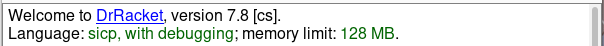
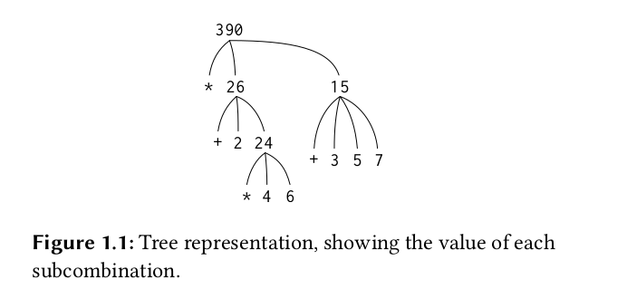

[TOC]

# Structure and Interpretation of computer Programs 2nd

## chapter 0 环境配置

SICP毕竟是一本比较古老的书，采用的语言是Scheme语言，一种典型的语法简单的函数式语言。

> ## 配置环境
>
> 以`DrRacket`作为IDE，从[这里](https://mirrors.tuna.tsinghua.edu.cn/racket-installers/recent/)下载，有`Linux` `macOS` `win`三个版本
>
> linux下载`xxx.sh`版本
>
> ```bash
> cd Downloads
> chmod +x xxxxx.sh
> ./xxxx.sh
> 按默认安装即可
> ```
>
> .png)
>
> 点击`file` ---> `package manager` ---> 搜索`sicp`回车、自动下载。
>
> ps:是从github上下载的，请保证网络环境！
>
> 完成后在上方输入`#lang sicp`在点右上`Run`
>
> 下方提示
>
> 即配置成功！

## chapter 1 Building Abstractions With Procedures

> # The Elements of Programming
>
> - primitve expressions(原始表达式) 语言的基本单位
> - measn of combination(组合) 如何将基本单位组合成更复杂的结构
> - means of abstraction（抽象）如何用模式或结构简化和组织代码

> [!Note]
>
> *Scheme* 语法知识
>
> 表达式采用前缀表达式(prefix)
>
> - accommodate procedures that may take an arbitrary number of arguments
>
>   - ```Scheme
>     (+ 21 35 12 7)
>     75
>     (* 25 4 12)
>     1200
>     ```
>
> - No ambiguity(歧义) can arise, because the operator is always the leftmost element and the entire combination is delimited(分割) by the parentheses
>
>   - ```scheme
>     (+ (* 3 5)(- 10 6))
>     19
>     (+ (* 3 (+ (* 2 4) (+ 3 5))) (+ (- 10 7) 6)) 
>     57
>     ; pretty-printing
>     (+ (* 3
>      	       (+ (* 2 4)
>      	           (+ 3 5)))
>     (+ (- 10 7)
>          6))
>     57
>     ```
>
> Naming and the Enviroment
>
> ```scheme
> ; 注意括号是必须的
> (define size 2)
> size
> 2
> (* 5 size)
> 10
> ; pi = 3.14159
> (define pi 3.14159)
> ; radius = 10
> (define radius 10)
> ; pi * r * r
> (* pi (* radius radius))
> 314.159
> ; circumference = 2 * pi * radius
> (define circumference (* 2 pi radius))
> circumference
> 62.8318
> ```

### Evaluating Combinations

重点在于`递归(recursion)`解析表达式

- Evaluate the subexpressions of the combination.
- Apply the procedure that is the value of the leftmost subsecpression(the operator) to the arguments that are the values of other subexpressions(the operands)

```scheme
(* ( + 2 ( * 4 6)))
	    (+ 3 5 7))
```

<details><summary>Tree represntation</summary>
    <div>
        
    </div>
</details>


