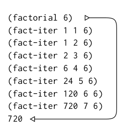

[TOC]

# Structure and Interpretation of computer Programs 2nd

## chapter 1 Building Abstractions With Procedures

> # The Elements of Programming
>
> - primitve expressions(原始表达式) 语言的基本单位
> - measn of combination(组合) 如何将基本单位组合成更复杂的结构
> - means of abstraction（抽象）如何用模式或结构简化和组织代码

> [!Note]
>
> *Scheme* 语法知识
>
> 表达式采用前缀表达式(prefix)
>
> - accommodate procedures that may take an arbitrary number of arguments
>
>   - ```Scheme
>     (+ 21 35 12 7)
>     75
>     (* 25 4 12)
>     1200
>     ```
>
> - No ambiguity(歧义) can arise, because the operator is always the leftmost element and the entire combination is delimited(分割) by the parentheses
>
>   - ```scheme
>     (+ (* 3 5)(- 10 6))
>     19
>     (+ (* 3 (+ (* 2 4) (+ 3 5))) (+ (- 10 7) 6)) 
>     57
>     ; pretty-printing
>     (+ (* 3
>      	       (+ (* 2 4)
>      	           (+ 3 5)))
>     (+ (- 10 7)
>          6))
>     57
>     ```
>
> Naming and the Enviroment
>
> ```scheme
> ; 注意括号是必须的
> (define size 2)
> size
> 2
> (* 5 size)
> 10
> ; pi = 3.14159
> (define pi 3.14159)
> ; radius = 10
> (define radius 10)
> ; pi * r * r
> (* pi (* radius radius))
> 314.159
> ; circumference = 2 * pi * radius
> (define circumference (* 2 pi radius))
> circumference
> 62.8318
> ```
>
> Conditional Expressions and Predicates(谓词)
>
> `cond`(stands for "conditional")
>
> ```scheme
> (define (abs x)
>    (cond ((> x 0) x)
>            ((= x 0) 0)
>            ((< x 0) (- x)))) 
> ; x前的空格千万不能忘记！
> 
> (define (abs x) 
>    (cond ((< x 0) (- x))
>          (else x)))
> 
> (define (abs x)
>   		  (if (< x 0)
>         (- x)
>       x ))
> ```
>
> `<if <predicate>> <consequent> <alternative>`
>
> > [!Caution]
> >
> > `if`并不是一个简单的函数，也是采用中断执行。尤其是在Scheme采用应用序的情况下。具体参考Ex1_6关于`new-if 函数实现`和Scheme内置的`if`的
>
> `not` `and` `or` 再Scheme里面`and` 和 `or` 一样是短路设计的
>
> ```scheme
> (and ( > x 5) ( < x 10)) ;  5 < x < 10
> (define (>= x y) (or (> x y) ( = x y)))
> ; 也可以写成
> (define (>= x y) (not (< x y)))
> ```

### Evaluating Combinations

重点在于`递归(recursion)`解析表达式

- Evaluate the subexpressions of the combination.
- Apply the procedure that is the value of the leftmost subsecpression(the operator) to the arguments that are the values of other subexpressions(the operands)

```scheme
(* ( + 2 ( * 4 6)))
	    (+ 3 5 7))
```

<details><summary>Tree represntation(Try it yourself)</summary>
    <div>
        
    </div>
</details>


> # take care of the primitive cases 
>
> - the values of numerals are the numbers that they name,
> -  the values of built-in operators are the machine instruction sequences that carry out the corresponding operations, and
> - the values of other names are the objects associated with those
>   names in the environment.
>
> >  [!Important]
> >
> > The key point to notice is the role of **the environment in determining the meaning** of the symbols in expressions.

Suche exceptions to the general evaluation rule are called *special forms*.the `define` is the only example of a special form that we have seen so far.

> [!Caution]
>
> **That is, (define x 3) is not a combination.**
>
> ```scheme
> (define x 3)
> ```
>
> **associate x wiht a value.**

### Compound Procedures

**procedure definitions**

**Example 1 to express "squaring"**

```scheme
(define (square x)(* x x))
```

> "We have here a compound procedure,which has been given the name square"

```scheme
<define <<name> <formal paramenters>> <body>>
```

the `name` is a symbol to be assocated with the procedure definition in the enviroment.

```scheme
; x^2 + y^2
(define (sum-of-squares x y)
     (+ (square x) (square y)))
  
  (sum-of-squares 3 4)
  25
  
  (define (f a)
    (sum-of-squares (+ a 1)(* a 2)))
  
  (f 5)
  136
```

<details><summary>Tips</summary>
    <div>
        <p>
        这个例子已经足够震撼了，如果对于刚学完C后人来说(但对于初学python<sup><a href="#footnote1">1</a></sup>的人来说可能司空见惯)。C语言里面函数是不能作为函数的参数的，但Scheme就这么水灵灵的把square 和 sum-of-square当成参数传进进去了，没有繁杂的函数指针，不需要思考类型转换！
        </p>
        <p id="footnote1">
            1. 虽然现在人为了便捷可能大概率会选择python入门，但我还是觉得用C才能更好的建立起CS的大厦。当然互联网民工是不需要的。但如果是想做互联网民工看SICP干吗呢？
        </p>
    </div>
</details>

结构(f 5) --- with the `substitution models` 

```scheme
(f 5)
(+ (square 6) (squrare 10))
(+ (* 6 6)(* 10 10))
(+ 36 100)
136
```


```mermaid
graph TD
A[f]-->|展开为|B[sum-of-squares]
C[5]-->|参数替换|B

    B-->|调用sum-of-squares计算|E[return 136]
    B-->D[展开为square]
   subgraph  黑箱
    D_1[square 6]
    D_2[square 10]
    D-->|替换|D_1
    D-->|替换|D_2
    D_1-->|计算|V_1[36]
    D_2-->|计算|V_2[100]
   V_1 & V_2 -->|+| F[136]
end
 F-->E

```

> [!Caution]
>
> substitution models 只是一个简单的抽象，并非真实的！


结构(f 5) --- with normal-order evaluation[^1]

```scheme
(sum-of-squares (+ 5 1)(* 5 2))
(+ (square (+ 5 1)))      (square (* 5 2)) )
(+ (* (+ 5 1)(+ 5 1))( *(* 5 2) (* 5 2)))
(+ (* 6 6)(* 10 10))
(+ 36 100)
136
```

[^1]:不得不说的一点，这个翻译为正则序到底是谁？计算机里面那么多正则真的无语！

```mermaid
graph TD
A[f]-->|展开为|B[sum-of-squares]
    B-->D[展开为square]
   subgraph  黑箱
	   D-->|展开|D_1[表达式1]
	   D-->|展开|D_2[表达式2]
	 	 	 C[5]
   D_1 & D_2 <-->|代入参数|C
	  	 C-->V_1[square 5 + 1] & V_2[square 5 *2]
	   V_1 --> v_1[6 * 6]
	    V_2 --> v_2[10 * 10]
   end
   	v_1 & v_2 -->|+|R[136]
      B-->|调用sum-of-squares计算|R[return 136]
```

> *normal-order evaluation* is "full expand and then reduce" ,发现只有当表达式完全展开后才会代入值计算。

> [!Important]
>
> 正则序 VS 应用序(applicative-order evaluation)
>
> ​	This alternative “fully expand and then reduce” evaluation method is known as normal-order evaluation, in contrast to the “evaluate the arguments and then apply” method that the interpreter actually uses, which is called applicative-order evaluation.

> [!important]
>
> Lisp uses "applicative-order"!
>
> 即 **先计算所有参数**，然后将这些已计算的结果应用到函数中。

### Example:Square Roots by Newton's Method

> [!NOte]
>
> **Mathematical function VS Computer Procedures**
>
> - Procedures must be effective!
>
> > The contrast between function and procedure is a reflection of the general distinciton between describing properties of things and describing how to do things, or , as it is sometimes referred to, the distinction between **declaratvie knowledge** and **imperative knowledge.**
>
> 举个例子
>
> $\sqrt(x) = the\ y\ such\ that\ y \geq 0\ and\ y^2=x$ 在数学上是合理的，但对于编程来说毫无意义，因为这个只是做了一个事物的描述，而非解决问题的方法。只是告诉你啥是某个数的算术平方根，但没有给出计算的手段。
>
> 而牛顿迭代法就是一种`Imperative knowledge`
>
> [参考链接1](https://math.mit.edu/~stevenj/18.335/newton-sqrt.pdf)
>
> [参考链接2_wiki](https://en.wikipedia.org/wiki/Newton%27s_method)


参考代码

```scheme
> (define (abs x)
    (if (< x 0)
        (- x)
        x ))
> (define (square x)
    (* x x))
> (define (sqrt-iter guess x)
    (if (good-enough? guess x)
        guess
        (sqrt-iter (improve guess x) x)))
> (define (improve guess x)
    (average guess(/ x guess)))
> (define (average x y)
    (/ (+ x y) 2))
> (define (good-enough? guess x)
    (< (abs (- (square guess) x)) 0.001))
> (define (sqrt x)
    (sqrt-iter 1.0 x))
```

> Scheme并没有`for` 和`while`循环，而是用类似于上面代码的各种调用来完成迭代。


### Linear Recursion and Iteration

**example: factorials function**

$n!=n\times(n-1)\times(n-1)\dots3\times2\times1$

```scheme
; 递归
(define (factorial n)
    (if (= n 1)
        1
        (* n (factorial (- n 1)))))
```


**substitution model**


```scheme
; 迭代实现
(define (factorial_iter n)
    (fact-iter 1 1 n))

(define (fact-iter product counter max-count)
    (if (> counter max-count)
        product
        (fact-iter  (* counter product)
                    (+ counter 1)
                    max-count)))
```




> [!Caution]
>
> 一个区别 `recursive procedure` vs `recursive process`
>
> 递归过程(recursive prcedure)指的是实现这个过程中，出现了函数调用函数自身的这个句法事实(syntactiv fact)比如上面的两个其实都是递归过程。
>
> 递归程序(recursive process)指的是这个程序用的是迭代的思想还是递归的思想构造的，比如说例子1,只有一个参数显然的递归思想，第二个每一步都包含完整的重建系统的信息典型的迭代思想。而不是关注语法面上的实现。

> [!NOte]
>
> - 递归所需要的系统资源更多，通过替换模型的模拟可以发现递归的模型是先伸长在压缩，而迭代模型始终只需要3个参数。
>
> - 迭代过程信息足够在任何步恢复程序，但递归有很多信息被隐藏在递归的过程之中，从任意点恢复通常是困难的。


> [!Important]
>
> **Special iteration constructs are syntactic sugar.**
>
> 总结一下，传统的`for` `while`循环在Scheme里面只是`tail recursive`的语法简化(语法🍬)原文如下
>
> > An implementation with this property is called tail-recursive. With a tail-recursive implementation, iteration can be expressed using the ordinary procedure call mechanism, so that special iteration constructs are useful only as syntactic sugar.
>
> 注意，对于支持(Taill Call Optimization)尾递归优化的语言，尾递归可以替换迭代。但如果不具有这种特性，则不能完全替代。递归终究是要申请(call)栈空间，而迭代(jump)不需要。

### Tree Recursion

**Example Fibonacci numbers**

$0, 1, 1, 2, 3, 5, 8, 13, 21,\dots$


```scheme
; 递归写法
(define (fib-rec n)
    (cond   ((= n 0) 0)
            ((= n 1) 1)
            (else  (+   (fib-rec (- n 1))
                        (fib-rec (- n 2))))))
```

这个代码与上面求阶乘的代码的区别在与递归的时候会调用两次自己`fib-rec(n-1)`与`fib-rec(n-1)`

展现其`Tree Recursion`


状态转移图


迭代版本

```scheme
; 迭代写法
(define (fib n)
    (fib-iter 1 0 n))
(define (fib-iter a b count)
    (if (= count 0)
        b
        (fib-iter (+ a b) a (- count 1))))
```


### Example:Counting change

​	**How many different ways can we make change for $1.00, given half-dollars, quarters, dimes, nickels, and pennies?** More generally, can we write a procedure to compute the number of ways to change any given amount of money?

```mermaid
graph TD
  A[开始: 输入金额 a 和 硬币种类数量 n] --> B{n == 0?}
  B -- 是 --> C[返回 0]  
  B -- 否 --> D{a == 0? or n < 0}
  D -- 是 --> E[返回 1]
  D -- 否 --> F{是否使用第一个硬币种类?}
  F -- 否 --> G[递归调用: 计算 a 使用剩余硬币种类数 n-1]
  F -- 是 --> H[递归调用: 计算 a-d 使用所有硬币种类数 n]
  G --> I[返回结果]
  H --> I
  I --> J[将两者结果相加]
  J --> K[返回结果]

```



简化版，如果是题目的要求应该有5层


**ordes of growth (近似增长量)**

> [!important]
>
> ⚠️$\theta$ 与$O$表示法有一定的区别

### Example Exponenfiation(快速幂)

常规的幂计算可以用如下递归思路解决

$b^n = b \times b^{n-1}$

$b^0 = 1$

转化成代码为：

```scheme
(define (expt b n)
   	(if (= n 0)
        1
        (* b (expt b (- n 1)))))
```

复杂度分析:$\theta(n)$空间复杂度$\theta(n)$

同理转化为迭代也是很简单的一件事

```scheme
; 迭代版本
(define (expt b n)
  	 	 (expt-iter b n 1))

(define (expt-iter b counter product)
   (if (= counter 0)
        product
       (expt-iter b
                  (- counter 1)
                  (* b product))))
```

复杂度分析:$\theta(n)$与$\theta(1)$

上述递归思路也可以用分治思路简化 (fast-expt)

$b^n = (b^{n/2})^2\ \ \ if\ n\ is\ even$

$b^n = b\times b^{n-1}\ \ \ if\ n\ is\ odd$

用scheme代码写出来就是

```scheme
(define (fast-expt b n)
    (cond ((= n 0) 1)
          ((even? n) (square (fast-expt b (/ n 2))))
          (else (* b (fast0expt b (-n 1))))))
```

复杂度分析:$\log(n)$与$\log(n)$

### Euclid's algorithm(辗转相除法)

```math
GCD(a,b)=GCD(b,r)\\
其中r = a \% b \\
```

复杂度分析:$\theta(\log (\min(a,b)))$ 

> 最坏情况来自于输入斐波那契数列相邻的两项Fib(n)与Fib(n-1)
>
> **Lamé’s Theorem**: If Euclid’s Algorithm requires k steps to compute the GCD of some pair, then the smaller number in the pair must be greater than or equal to the kth Fibonacci number

### Testing for Primality(检测素数)

方法一：朴素法$\theta(\sqrt n)$

```scheme
(define (smallest-divisor n)
   (find-divisor n 2))

(define (find-divisor n test-divisor)
   (cond ((> (square test-divisor) n) n)
         ((divides? test-divisor n) test-divisor)
         (else (find-divisor n (+ test-divisor 1)))))

(define (prime? n)
  (= n (smallest-divisor n)))
```

⚠️如果是最最朴素的应该是便利整个(1-n)，但事实上只需要查看(1-$\sqrt n$)即可。

> 如果x能被b整除，则商和除数必然有一个小于等于$\sqrt n$

方法二 费马测试

基于费马小定理

> If n is a prime number and a is any positive integer less than n, then a raised to the nth power is congruent to a modulo n.
>
> (Ps:"congurent modulo"模同余 两个数同时除以一个相同的数，得到的余数相同。)

⚠️费马测试是基于概率的推断，而非准确的证明一个数确实素数。

基本思路

```mermaid
graph TD
    A[开始] --> B["选择随机整数 a (1 < a < n-1)"]
    B --> C["计算 a^(n-1) % n"]
    C --> D{"a^(n-1) % n == 1?"}
    D -->|是| E[继续选择不同的 a 进行测试]
    D -->|否| F[返回“n 不是素数”]
    E --> G{是否所有 a 都通过测试?}
    G -->|是| H[返回“n 可能是素数”]
    G -->|否| F
    F --> I[结束]
    H --> I[结束]
```



------

**构建高阶过程**

### Procedures as Arguments(过程作为参数) 

#### *Lambda$(\lambda)$*构建匿名函数

```scheme
(lambda (x) (+ x 4)) ; 
```

常用于一个过程内部定义一个不会被外部使用的过程

```scheme
(define (pi-sum a b)
  		  (sum (lambda (x) (/ 1.0 (* x (+ x 2))))
            a
            (lambda (x) (+ x 4))
            b))
```

> `lambda`和`define`在大体上保持一致的作用,唯一的区别在于`lambda`并没有和一个`name`相互关联,而`define`必然会把一个过程一个名字狠狠的绑定在一起!

#### *Let*构建local variables(局部变量)

